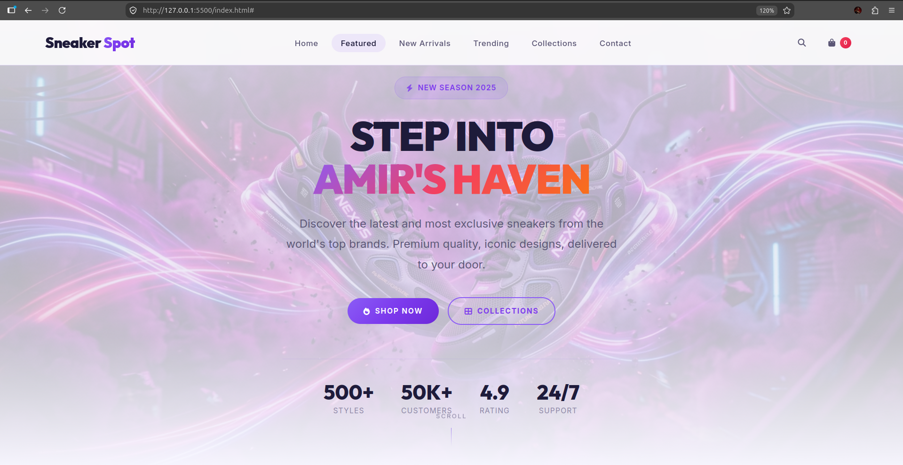
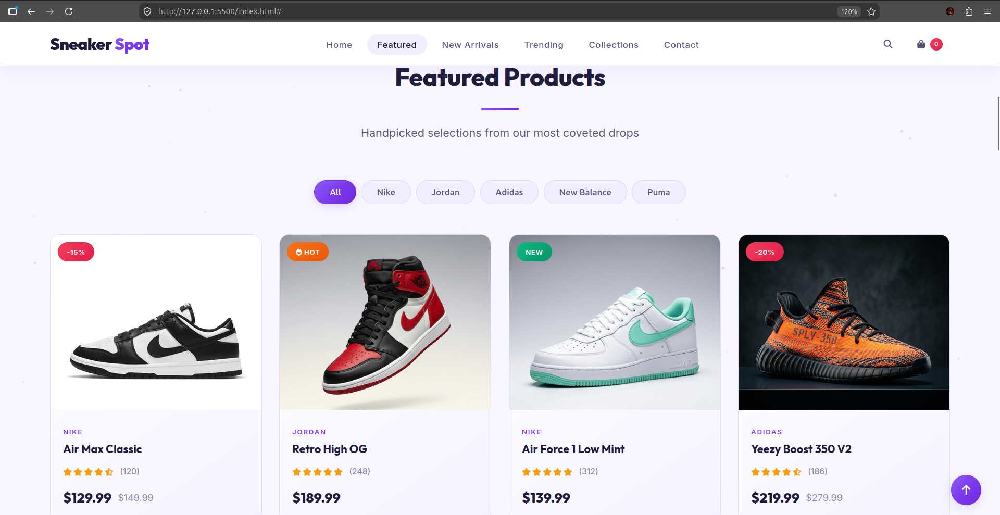
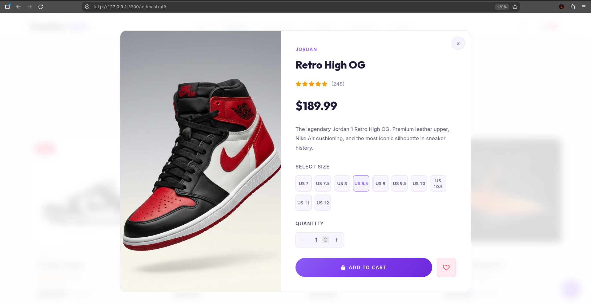

# SneakerSpot - Premium Sneaker Store Website

---

## 📸 Demo

### Product Catalog

### Checkout Experience

### View Item

---

## Overview
This is a modern, responsive website template for a premium sneaker store called "SneakerSpot". The website is designed to showcase sneaker products with an attractive and user-friendly interface to help attract customers.

## Features
- Responsive design that works on desktop, tablet, and mobile devices
- Modern and clean user interface with smooth animations
- Product showcase with featured items and new arrivals
- Quick view functionality for product details
- Collection categories to organize different types of sneakers
- Newsletter subscription form
- Social media integration
- Responsive navigation menu

## Files Structure
- `index.html` - The main HTML file containing the website structure
- `styles.css` - CSS file with all the styling for the website
- `script.js` - JavaScript file with interactive functionality
- `images/` - Directory containing all image assets
  - SVG images for sneaker products and collection backgrounds

## How to Use
1. Open the `index.html` file in a web browser to view the website
2. Navigate through the different sections using the navigation menu
3. Click on "Quick View" buttons to see product details
4. Explore the different collections
5. Test the responsive design by resizing your browser window

## Customization
You can customize this template by:
1. Replacing the SVG placeholder images with actual product images
2. Updating product information and prices
3. Changing the color scheme in the CSS file
4. Adding additional pages like product detail pages, about us, etc.
5. Integrating with a backend system for e-commerce functionality

## Technical Details
- Built with HTML5, CSS3, and JavaScript
- Uses Flexbox and CSS Grid for layouts
- Responsive design with media queries
- Font Awesome icons for visual elements
- Custom animations and transitions
- No external libraries or frameworks required

## Browser Compatibility
- Chrome (latest)
- Firefox (latest)
- Safari (latest)
- Edge (latest)
- Opera (latest)

## Credits
Designed and developed as a template for a sneaker store website. All product names and images are placeholders and should be replaced with actual content before publishing.
